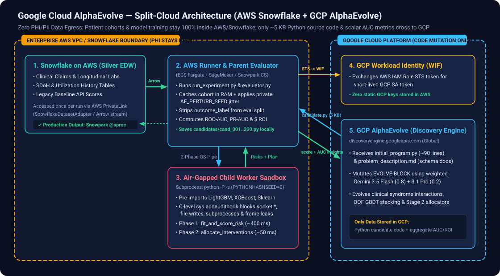

# AlphaEvolve Clinical Classifier — Split-Cloud Migration Guide (AWS Snowflake + GCP AlphaEvolve)



## 1. Executive Summary & Security Posture

Healthcare organizations often store member claims, clinical labs, social determinants of health (SDoH), and legacy model scores in **Snowflake on AWS**. Because Google Cloud AlphaEvolve (`discoveryengine.googleapis.com`) uses a **pull-based evaluation loop**, you can run all data loading, feature engineering, GBDT training, and candidate evaluation **100% inside AWS**, while keeping only the LLM code-mutation loop in GCP:

- **Zero PHI/PII Data Egress**: Patient-level records never leave your AWS VPC / Snowflake environment.
- **No Inbound Firewall Holes into AWS**: The AWS runner (`run_experiment.py`) initiates all connections **outbound over HTTPS (`443`)** to `discoveryengine.googleapis.com`.
- **Keyless Cross-Cloud Auth**: Uses **GCP Workload Identity Federation (WIF)** so an AWS IAM Role (`ecsTaskExecutionRole` / SageMaker execution role) exchanges its AWS STS identity token for a short-lived GCP token impersonating `alpha-evolve-client@<PROJECT_ID>.iam.gserviceaccount.com`.
- **Air-Gapped Candidate Execution**: Candidate code pulled from GCP runs in a child subprocess (`python -P -s`) where `sys.addaudithook` blocks all network (`socket.*`), subprocess, and filesystem write operations. Candidates receive training and label-stripped evaluation records over an in-memory OS pipe.

---

## 2. Step-by-Step Migration Checklist

### Step 1: Configure Keyless AWS $\rightarrow$ GCP Workload Identity Federation

Run these commands once in your GCP project so your AWS compute role can call the AlphaEvolve API without storing a static GCP service account key in AWS:

```bash
export GCP_PROJECT_ID="your-gcp-project-id"
export GCP_PROJECT_NUMBER=$(gcloud projects describe "$GCP_PROJECT_ID" --format="value(projectNumber)")
export AWS_ACCOUNT_ID="<your-12-digit-aws-account-id>"
export AWS_ROLE_NAME="AlphaEvolveRunnerRole"

# 1. Create a Workload Identity Pool & AWS Provider in GCP
gcloud iam workload-identity-pools create "aws-alphaevolve-pool" \
  --project="$GCP_PROJECT_ID" \
  --location="global" \
  --display-name="AlphaEvolve AWS Runner Pool"

gcloud iam workload-identity-pools providers create-aws "aws-provider" \
  --project="$GCP_PROJECT_ID" \
  --location="global" \
  --workload-identity-pool="aws-alphaevolve-pool" \
  --account-id="$AWS_ACCOUNT_ID"

# 2. Allow the AWS IAM Role to impersonate the alpha-evolve-client GCP Service Account
gcloud iam service-accounts add-iam-policy-binding \
  "alpha-evolve-client@${GCP_PROJECT_ID}.iam.gserviceaccount.com" \
  --project="$GCP_PROJECT_ID" \
  --role="roles/iam.workloadIdentityUser" \
  --member="principalSet://iam.googleapis.com/projects/${GCP_PROJECT_NUMBER}/locations/global/workloadIdentityPools/aws-alphaevolve-pool/attribute.aws_role/arn:aws:sts::${AWS_ACCOUNT_ID}:assumed-role/${AWS_ROLE_NAME}"

# 3. Generate the credential config file (commit-safe, contains no secrets)
gcloud iam workload-identity-pools create-cred-config \
  "projects/${GCP_PROJECT_NUMBER}/locations/global/workloadIdentityPools/aws-alphaevolve-pool/providers/aws-provider" \
  --service-account="alpha-evolve-client@${GCP_PROJECT_ID}.iam.gserviceaccount.com" \
  --aws \
  --output-file="aws_gcp_wif_credentials.json"
```

On the AWS runner container, set:
```bash
export GOOGLE_APPLICATION_CREDENTIALS="/app/aws_gcp_wif_credentials.json"
```
`google.auth.default()` in [`run_experiment.py`](../run_experiment.py) automatically uses the AWS EC2/ECS/SageMaker metadata server to mint short-lived GCP tokens.

---

### Step 2: Connect `SnowflakeDatasetAdapter` in AWS (Once per Run)

Candidate programs (`initial_program.py`) **never** import `snowflake` or open network connections. Instead, the parent evaluator process loads the cohort once from Snowflake via [`SnowflakeDatasetAdapter`](../src/data_adapters.py) over AWS PrivateLink and caches the `PatientRecord` tuples in parent memory.

1. Install the optional Snowflake connector in the AWS runner image:
   ```bash
   uv add "snowflake-connector-python[pandas]>=3.10.0"
   ```
2. Configure the Snowflake source in [`src/data_adapters.py`](../src/data_adapters.py):
   ```python
   from data_adapters import SnowflakeConfig, SnowflakeDatasetAdapter

   sf_config = SnowflakeConfig(
       account="clinical-edw.us-east-1.privatelink",
       warehouse="WH_CLINICAL_ML",
       database="PROD_CLINICAL_SILVER",
       schema="CARE_MGMT",
       table_or_view="VW_READMISSION_30D_COHORT",
   )
   adapter = SnowflakeDatasetAdapter(
       config=sf_config,
       feature_columns=("egfr", "hba1c", "nt_probnp", "shock_index", "lactate_peak"),
   )
   ```
3. Alternatively, export the Snowflake view to a VPC-local Parquet/CSV volume at container startup and reference `"train_csv"` / `"eval_csv"` in `problems/<problem_id>/problem_config.json`.

---

### Step 3: Run the Evolution Controller on AWS Compute

Deploy this repository as a container on **AWS ECS Fargate**, **AWS SageMaker Training/Processing**, or **Snowpark Container Services (SPCS)**:

```bash
# Inside the AWS container (with AWS IAM Role attached + WIF config mounted)
export GOOGLE_APPLICATION_CREDENTIALS="/app/aws_gcp_wif_credentials.json"
export AE_PERTURB_SEED="$(aws secretsmanager get-secret-value --secret-id alphaevolve/clinical/perturb-seed --query SecretString --output text)"
export AE_HELDOUT_SEED="$(aws secretsmanager get-secret-value --secret-id alphaevolve/clinical/heldout-seed --query SecretString --output text)"

uv run python run_experiment.py --problem readmission_30d
```

During the run:
- All 40–200 evaluated candidates are written locally in AWS to `artifacts/runs/<problem_id>/<experiment_id>/candidates/<candidate_id>.py` along with `candidates.json` (recording unified diffs, `what_changed`, and all clinical/financial output measures).
- Only the scalar fitness score and 8 lines of aggregate cohort metrics are sent back to GCP Discovery Engine.

---

### Step 4: Promote the Winning Candidate (`rank1.py`) to Snowflake / AWS Production

Because `rank1.py` is a pure Python module importing `clinical_toolkit`, `numpy`, `scipy`, `scikit-learn`, `lightgbm`, and `xgboost` (all pre-installed in the **Snowflake Anaconda Channel**), you can deploy the winning algorithm directly back into Snowflake as a **Snowpark Python Stored Procedure**:

```sql
CREATE OR REPLACE PROCEDURE PROD_CLINICAL_SILVER.CARE_MGMT.SP_SCORE_AND_ALLOCATE_READMISSION()
RETURNS TABLE (PATIENT_ID VARCHAR, PREDICTED_RISK FLOAT, ASSIGNED_INTERVENTION VARCHAR)
LANGUAGE PYTHON
RUNTIME_VERSION = '3.11'
PACKAGES = ('snowflake-snowpark-python', 'numpy', 'scipy', 'scikit-learn', 'lightgbm', 'xgboost')
IMPORTS = (
    '@CARE_MGMT_STAGE/alpha_evolve/src/clinical_models.py',
    '@CARE_MGMT_STAGE/alpha_evolve/src/clinical_toolkit.py',
    '@CARE_MGMT_STAGE/alpha_evolve/artifacts/runs/readmission_30d/rank1.py'
)
HANDLER = 'run_daily_batch';
```
